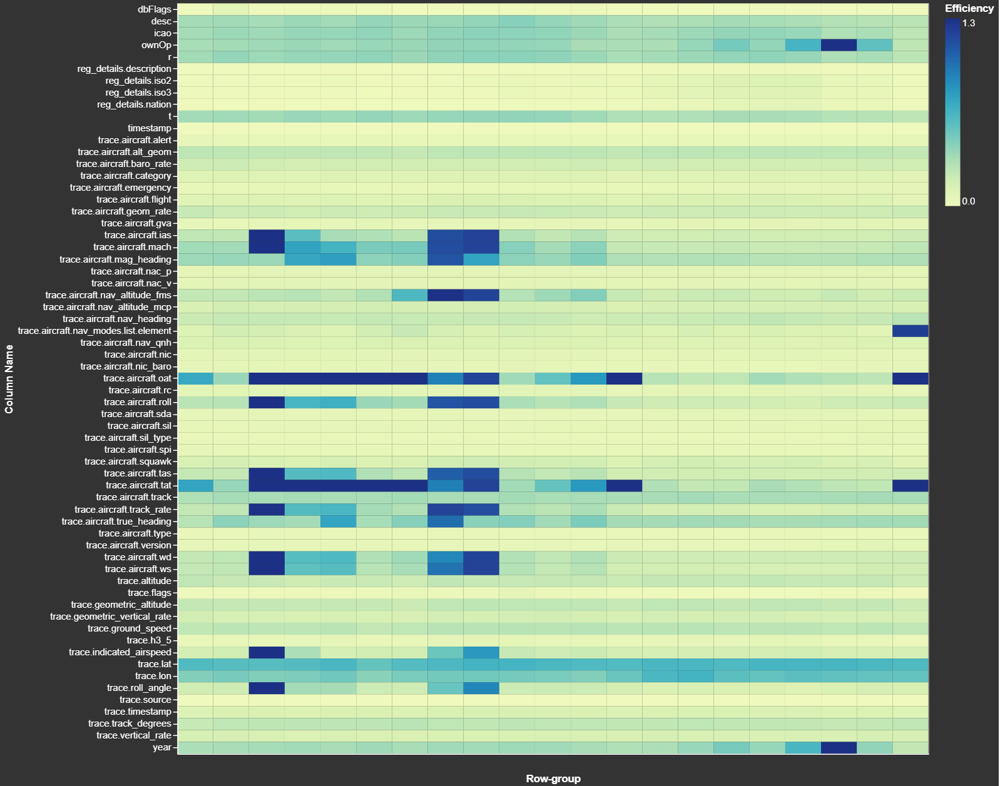

# pqview

This package reports statistics on the make-up of Parquet files. These reports are meant to be human-friendly rather than machine-readable.

## Commands Available

```bash
$ python3 ~/pqview/main.py \
    --help
```

```
 Usage: main.py [OPTIONS] COMMAND [ARGS]...

╭─ Options ────────────────────────────────────────────────────────╮
│ --install-complet…        [bash|zsh|fish|po  Install completion  │
│                           wershell|pwsh]     for the specified   │
│                                              shell.              │
│                                              [default: None]     │
│ --show-completion         [bash|zsh|fish|po  Show completion for │
│                           wershell|pwsh]     the specified       │
│                                              shell, to copy it   │
│                                              or customize the    │
│                                              installation.       │
│                                              [default: None]     │
│ --help                                       Show this message   │
│                                              and exit.           │
╰──────────────────────────────────────────────────────────────────╯
╭─ Commands ───────────────────────────────────────────────────────╮
│ minmax            Minimum and maximum values of a column's       │
│                   row-groups                                     │
│ most-compressed   Most-compressed column in any one row-group    │
│ overall           Statistics on the overall file                 │
│ ratios            Compression ratios of each column by row-group │
│ ratios-by-column  Compression ratios of each column by row-group │
│ row-groups        Number of records per row-group                │
│ schemes           Every compression scheme used                  │
│ sizes             Disk space consumption of each column in       │
│                   compressed form                                │
│ types             Disk space consumption of each data type in    │
│                   compressed form                                │
╰──────────────────────────────────────────────────────────────────╯
```

## Installation

If you are running Ubuntu 20.04 LTS or newer, the following will install the latest stable version of git and Python.

```bash
$ sudo apt update
$ sudo apt install \
    awscli \
    git \
    python3-pip \
    python3-virtualenv
```

If you want to run this software on macOS instead, after installing [brew](https://brew.sh/), a popular command-line package manager for macOS, run the following.

```bash
$ brew install \
    awscli \
    git \
    virtualenv \
    wget
```

Clone the repository:

```bash
$ git clone https://github.com/marklit/pqview ~/pqview
```

Then set up a virtual environment for pqview. The virtual environment will ensure its Python dependencies won't interfere with other Python-based projects on your system.

```bash
$ virtualenv ~/.pqview
$ source ~/.pqview/bin/activate
$ python3 -m pip install -r ~/pqview/requirements.txt
```

## Example Usage

The following will download a few example Parquet files.

```bash
$ aws s3 cp --no-sign-request \
    s3://overturemaps-us-west-2/release/2024-01-17-alpha.0/theme\=buildings/type\=building/part-00046-cf0ca35a-8871-4c98-bfb8-13026efbae55-c000.zstd.parquet \
    ./tokyo.pq

$ aws s3 cp --no-sign-request \
    s3://ookla-open-data/parquet/performance/type=mobile/year=2022/quarter=1/2022-01-01_performance_mobile_tiles.parquet \
    ./ookla.pq
```

### Overall Statistics

```bash
$ python3 ~/pqview/main.py \
    overall tokyo.pq
```

```
<pyarrow._parquet.FileMetaData object at 0x108fd95d0>
  created_by: parquet-mr version 1.12.3-databricks-0002 (build 2484a95dbe16a0023e3eb29c201f99ff9ea771ee)
  num_columns: 33
  num_rows: 18603581
  num_row_groups: 133
  format_version: 1.0
  serialized_size: 649941
```

### Number of Records / Row-Group

```bash
$ python3 ~/pqview/main.py \
            row-groups \
            tokyo.pq \
    | head
```

```
|   num_rg |   num_records |
|----------+---------------|
|        3 |        139180 |
|        2 |        134010 |
|        2 |        139750 |
|        2 |        150430 |
|        2 |        139830 |
|        2 |        139980 |
|        1 |        152090 |
|        1 |        152850 |
```

```bash
$ python3 ~/pqview/main.py \
            row-groups \
            --sort-key=records \
            tokyo.pq \
    | head
```

```
|   num_records |   num_rg |
|---------------+----------|
|        157150 |        1 |
|        156710 |        1 |
|        156630 |        1 |
|        156060 |        1 |
|        156000 |        1 |
|        155970 |        1 |
|        155890 |        1 |
|        155830 |        1 |
```

### List Every Compression Scheme Used

```bash
$ python3 ~/pqview/main.py \
    schemes tokyo.pq
```

```
ZSTD
```

### Per-Column Space Usage

```bash
$ python3 ~/pqview/main.py \
    sizes tokyo.pq
```

```
    1.2 GB geometry
  189.8 MB id
  121.4 MB bbox.maxy
  121.3 MB bbox.miny
  119.7 MB bbox.maxx
  119.6 MB bbox.minx
   82.6 MB sources.list.element.recordId
   10.7 MB updateTime
    2.9 MB height
    2.6 MB sources.list.element.confidence
    2.1 MB names.common.list.element.value
    1.1 MB sources.list.element.dataset
  584.1 kB class
  386.7 kB names.common.list.element.language
  310.8 kB names.official.list.element.value
  296.4 kB names.alternate.list.element.value
  285.1 kB names.official.list.element.language
  284.5 kB names.short.list.element.value
  281.1 kB names.short.list.element.language
  281.0 kB names.alternate.list.element.language
  273.3 kB numFloors
  150.9 kB sources.list.element.property
   93.6 kB roofShape
   82.7 kB facadeColor
   77.9 kB roofColor
   60.6 kB hasParts
   48.6 kB facadeMaterial
   48.5 kB version
   46.6 kB level
   46.2 kB roofMaterial
   44.7 kB roofOrientation
   41.2 kB roofDirection
   40.4 kB eaveHeight
```

### Per-Type Space Usage

```bash
$ python3 ~/pqview/main.py \
    types tokyo.pq \
    | head
```

```
    1.5 GB BYTE_ARRAY
  487.5 MB DOUBLE
  368.3 kB INT32
   60.6 kB BOOLEAN
```

As HTML:

```bash
$ python3 ~/pqview/main.py \
    types --html tokyo.pq \
    > sunburst_by_type.html
```


### Most compressed row-group-column

```bash
$ python3 ~/pqview/main.py \
    most-compressed \
    --min-size=500000 \
    tokyo.pq
```

```
From 503.5 kB to 74.8 kB (ratio of 6:1)

<pyarrow._parquet.ColumnChunkMetaData object at 0x10ffd9990>
  file_offset: 410490115
  file_path:
  physical_type: DOUBLE
  num_values: 138030
  path_in_schema: sources.list.element.confidence
  is_stats_set: True
  statistics:
    <pyarrow._parquet.Statistics object at 0x10ffd9a30>
      has_min_max: True
      min: 0.65
      max: 0.98
      null_count: 75391
      distinct_count: None
      num_values: 62639
      physical_type: DOUBLE
      logical_type: None
      converted_type (legacy): NONE
  compression: ZSTD
  encodings: ('RLE', 'PLAIN')
  has_dictionary_page: False
  dictionary_page_offset: None
  data_page_offset: 410490115
  total_compressed_size: 74789
  total_uncompressed_size: 503536
```

### Row Group Counts for each compression ratio

```bash
$ python3 ~/pqview/main.py \
    ratios \
    --reverse \
    --sort-key=num_rg \
    ookla.pq
```

```
| ratio   |   num_rg |
|---------+----------|
| 5.0:1   |        2 |
| 1.7:1   |        2 |
| 1.0:1   |        2 |
| 1.4:1   |        1 |
```

### Compression Ratio HeatMap

```bash
$ python3 ~/pqview/main.py \
    ratios-by-column test.pq \
    > compression_ratio_heatmap.html
```



### Minimum & Maximum Values

This indicates how well sorted a column is.

```bash
$ python3 ~/pqview/main.py \
    minmax tokyo.pq bbox.minx \
    | head
```

```
|   rg_num |      min |      max |
|----------+----------+----------|
|        0 |  -71.634 |  -70.313 |
|        1 |  -71.667 |  -64.688 |
|        2 |  -70.465 |  -48.164 |
|        3 | -122.519 |  -47.813 |
|        4 | -123.003 | -122.344 |
|        5 | -122.514 | -122.388 |
|        6 | -122.695 | -122.358 |
|        7 | -122.520 | -111.094 |
```